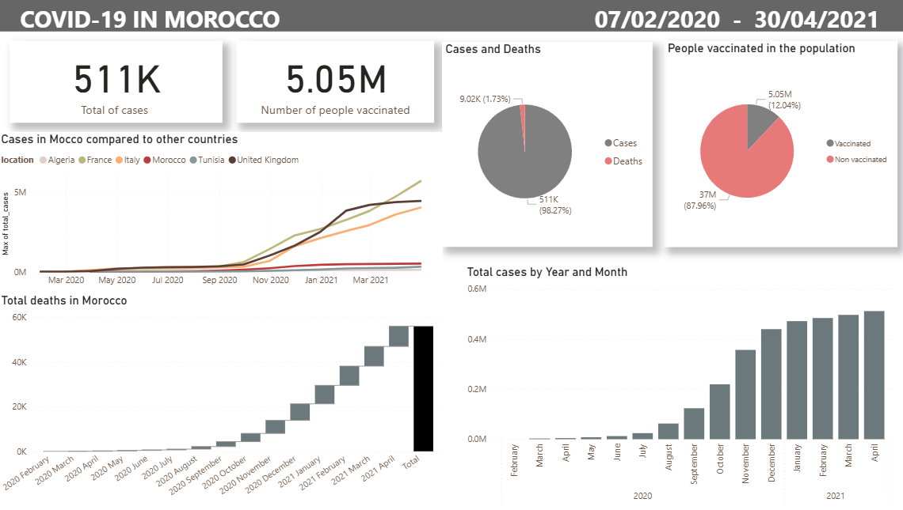

# 🦠 COVID-19 Data Analysis — SQL, Excel & Power BI

## 📌 Overview  
This project analyzes the spread and impact of COVID-19 globally and in Morocco from January 2020 to April 2021.  
It highlights the data preparation process, SQL transformations, and Power BI dashboards built to visualize key insights.

---

## 🔧 Process  

### 1️⃣ Data Collection & Cleaning  
- The original dataset was imported and  cleaned in **Excel**.  
- Basic cleaning steps included removing unnecessary columns, handling missing values, and standardizing date formats.  
- A subset of the data focusing on **Morocco** was extracted for a dedicated national analysis.

### 2️⃣ Data Transformation in SQL  
- The cleaned data was imported into **PostgreSQL (pgAdmin4)**.  
- New tables were created using SQL:
  - `covid_deaths`
  - `vaccinations_in_morocco`  
- SQL queries were used to calculate:
  - Infection and death rates  
  - Vaccination coverage  
  - Other key health metrics by country and date 

### 3️⃣ Data Export & Integration  
After transformations, the data was exported as CSV files to ensure compatibility with Power BI.  
These CSVs were used as the foundation for creating the dashboards.  

### 4️⃣ Data Visualization in Power BI  
Two interactive dashboards were developed in **Power BI**:  
- 🌍 **COVID-19 Around the World** — global cases, deaths, and vaccination trends.  
- 🇲🇦 **COVID-19 in Morocco** — focused insights on Moroccan cases, deaths, and vaccination progress.  

Each dashboard combines visuals such as bar charts, line charts, pie charts, and maps to make the data intuitive and easy to explore.  

---

## 🧰 Tools Used  
- **Excel** – Data cleaning and initial preparation  
- **PostgreSQL (pgAdmin4)** – SQL transformations and analysis  
- **Power BI** – Dashboard creation and data visualization  

---

## 📷 Dashboards  
**COVID-19 in Morocco**  
  

**COVID-19 Around the World**  
  

---

## 🧠 Summary  
This project demonstrates a complete data analysis workflow from raw data cleaning and SQL modeling to advanced data visualization.  
It showcases how different tools can be combined to produce actionable insights and communicate complex data clearly and effectively.
